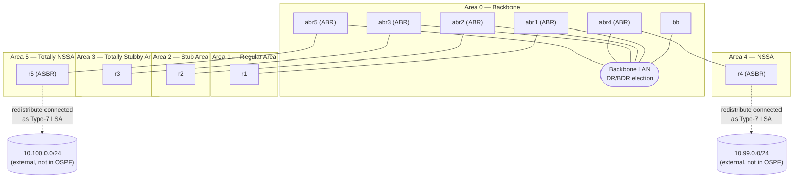

# netlab-ospf-lab

A hands-on lab that uses [NetLab](https://netlab.tools) and [Containerlab](https://containerlab.dev) with [FRRouting (FRR)](https://frrouting.org) containers to demonstrate the six fundamental OSPF area types in a single, reproducible topology.

---

## Lab Topology



| Router | Role | Area |
|--------|------|------|
| `bb` | Backbone router | Area 0 |
| `abr1` | Area Border Router | Area 0 ↔ Area 1 |
| `abr2` | Area Border Router | Area 0 ↔ Area 2 |
| `abr3` | Area Border Router | Area 0 ↔ Area 3 |
| `abr4` | Area Border Router | Area 0 ↔ Area 4 |
| `abr5` | Area Border Router | Area 0 ↔ Area 5 |
| `r1` | Internal router | Area 1 (Regular) |
| `r2` | Internal router | Area 2 (Stub) |
| `r3` | Internal router | Area 3 (Totally Stubby) |
| `r4` | Internal router / ASBR | Area 4 (NSSA) |
| `r5` | Internal router / ASBR | Area 5 (Totally NSSA) |

---

## OSPF Area Types Explained

### Area 0 — Backbone Area
Every OSPF autonomous system has exactly one backbone area (`0.0.0.0`). All other areas must connect directly to it (via an ABR) to exchange routing information. The backbone carries all inter-area and external routes as Type-3/4/5 LSAs. In this lab `bb` is the central backbone router and the five ABRs (`abr1`–`abr5`) all share a **single broadcast LAN segment** in Area 0. Because the segment has more than two routers, OSPF performs **DR/BDR election** on it — one router is elected Designated Router (DR) and another is elected Backup Designated Router (BDR) to reduce the number of adjacencies and LSA flooding on the segment.

### Area 1 — Regular (Standard) Area
A regular area behaves identically to the backbone: it receives all LSA types (Type 1–5). Every prefix in the OSPF domain, including external routes redistributed anywhere else, is visible to `r1`. This is the default area type and requires no extra configuration.

### Area 2 — Stub Area
A stub area blocks **Type-5 LSAs** (AS-external routes). Instead of carrying external prefixes, the ABR (`abr2`) injects a single **default route** (`0.0.0.0/0`) into the area. This reduces the size of the LSDB and is ideal for sites that have only one exit point toward the rest of the network. Router `r2` reaches all external destinations through that default route.

The `ospf.areas` plugin automatically applies the equivalent of:
```
router ospf
 area 0.0.0.2 stub
```

### Area 3 — Totally Stubby Area
A totally stubby area is a Cisco-originated extension (supported by FRR) that blocks **Type-3, -4, and -5 LSAs**, leaving only the default route injected by the ABR. Router `r3` has the smallest possible LSDB: only intra-area routes and one default route. This is the most restrictive area type and is ideal for stub sites with a single upstream ABR.

The `ospf.areas` plugin automatically applies the equivalent of:
```
router ospf
 area 0.0.0.3 stub no-summary
```
> `no-summary` is the keyword that suppresses Type-3 summary LSAs, making the stub area "totally stubby".

### Area 4 — Not-So-Stubby Area (NSSA)
An NSSA blocks Type-5 external LSAs like a stub area, **but allows an ASBR inside the area** to redistribute external routes. Instead of Type-5, the ASBR generates **Type-7 LSAs** that are local to the NSSA. The ABR (`abr4`) translates selected Type-7 LSAs into Type-5 LSAs before flooding them into the backbone. In this lab `r4` acts as the ASBR.

The `10.99.0.0/24` link on `r4` has `role: external`, which means the interface is **not** part of the OSPF process at all. NetLab's `ospf.import: [connected]` on `r4` redistributes those connected routes into OSPF as Type-7 LSAs.

The `ospf.areas` plugin automatically applies the equivalent of:
```
router ospf
 area 0.0.0.4 nssa
```

### Area 5 — Totally NSSA (NSSA No-Summary)
A Totally NSSA combines the properties of NSSA and Totally Stubby: Type-5 external LSAs are blocked *and* Type-3 inter-area summary LSAs are suppressed. An ASBR inside the area can still inject external routes as **Type-7 LSAs** (converted at the ABR to Type-5 for the backbone). Router `r5` receives only intra-area routes and a single default route from `abr5`.

The `10.100.0.0/24` link on `r5` has `role: external`, which means the interface is **not** part of the OSPF process at all. NetLab's `ospf.import: [connected]` on `r5` redistributes those connected routes into OSPF as Type-7 LSAs.

The `ospf.areas` plugin automatically applies the equivalent of:
```
router ospf
 area 0.0.0.5 nssa no-summary
```
> `no-summary` added to the `nssa` keyword suppresses Type-3 summary LSAs, making it "Totally NSSA".

---

## Prerequisites

### 1. Install NetLab
Follow the official installation guide:
👉 **https://netlab.tools/install/**

NetLab installs all required dependencies (including Containerlab and the FRR container image) automatically. The quickest way to get started:

```bash
python3 -m pip install networklab
netlab install --all
```

### 2. Clone this repository
```bash
git clone https://github.com/severindellsperger/netlab-ospf-lab.git
cd netlab-ospf-lab
```

---

## Starting the Lab

```bash
netlab up
```

`netlab up` will:
1. Parse `topology.yml` and calculate IP addresses and OSPF parameters.
2. Use the `ospf.areas` plugin to automatically configure stub, totally-stubby, NSSA, and totally-NSSA area types on every router.
3. Generate Containerlab and FRR configuration files.
4. Start all containers via Containerlab.
5. Deploy the generated FRR configuration to every container.

After a few seconds all OSPF adjacencies should come up. You can verify:

```bash
# Show OSPF neighbours on the backbone router
netlab connect bb -- vtysh -c "show ip ospf neighbor"

# Show the LSDB on r3 (Totally Stubby – should contain only Type-1 and the default Type-3)
netlab connect r3 -- vtysh -c "show ip ospf database"

# Show the routing table on r2 (Stub – external routes replaced by a default route)
netlab connect r2 -- vtysh -c "show ip route ospf"
```

---

## Stopping the Lab

```bash
netlab down
```

`netlab down` destroys all containers and removes the generated configuration files, leaving the repository in a clean state.

---

## License

This lab is provided as-is for educational purposes.
