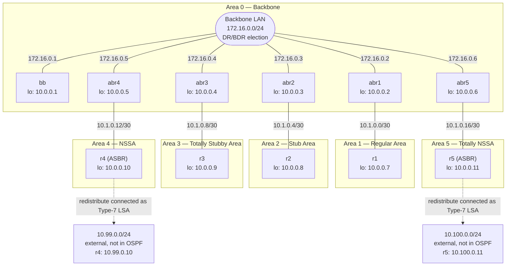

# netlab-ospf-lab

[](https://codespaces.new/severindellsperger/netlab-ospf-lab?machine=basicLinux32gb&devcontainer_path=.devcontainer/devcontainer.json)

A hands-on lab that uses [NetLab](https://netlab.tools) and [Containerlab](https://containerlab.dev) with [Nokia SR Linux](https://learn.srlinux.dev) containers to demonstrate the six fundamental OSPF area types in a single, reproducible topology.

> **No manual image setup required.** The Nokia SR Linux container image (`ghcr.io/nokia/srlinux`) is free and publicly available. Containerlab pulls it automatically on first run.

---

## Lab Topology


```mermaid
graph TB
    subgraph area0["Area 0 — Backbone"]
        lan0(["`Backbone LAN
        172.16.0.0/24
        DR/BDR election`"])
        bb["`bb
        lo: 10.0.0.1`"]
        abr1["`abr1
        lo: 10.0.0.2`"]
        abr2["`abr2
        lo: 10.0.0.3`"]
        abr3["`abr3
        lo: 10.0.0.4`"]
        abr4["`abr4
        lo: 10.0.0.5`"]
        abr5["`abr5
        lo: 10.0.0.6`"]
    end

    lan0 -- "172.16.0.1" --- bb
    lan0 -- "172.16.0.2" --- abr1
    lan0 -- "172.16.0.3" --- abr2
    lan0 -- "172.16.0.4" --- abr3
    lan0 -- "172.16.0.5" --- abr4
    lan0 -- "172.16.0.6" --- abr5

    subgraph area1["Area 1 — Regular Area"]
        r1["`r1
        lo: 10.0.0.7`"]
    end
    abr1 -- "10.1.0.0/30" --- r1

    subgraph area2["Area 2 — Stub Area"]
        r2["`r2
        lo: 10.0.0.8`"]
    end
    abr2 -- "10.1.0.4/30" --- r2

    subgraph area3["Area 3 — Totally Stubby Area"]
        r3["`r3
        lo: 10.0.0.9`"]
    end
    abr3 -- "10.1.0.8/30" --- r3

    subgraph area4["Area 4 — NSSA"]
        r4["`r4 (ASBR)
        lo: 10.0.0.10`"]
    end
    abr4 -- "10.1.0.12/30" --- r4

    ext4["`10.99.0.0/24
    external, not in OSPF
    r4: 10.99.0.10`"]
    r4 -. "redistribute connected as Type-7 LSA" .-> ext4

    subgraph area5["Area 5 — Totally NSSA"]
        r5["`r5 (ASBR)
        lo: 10.0.0.11`"]
    end
    abr5 -- "10.1.0.16/30" --- r5

    ext5["`10.100.0.0/24
    external, not in OSPF
    r5: 10.100.0.11`"]
    r5 -. "redistribute connected as Type-7 LSA" .-> ext5
```

| Router | Role | Area |
|--------|------|------|
| `bb` | Backbone router | Area 0 |
| `abr1` | Area Border Router | Area 0 ↔ Area 1 |
| `abr2` | Area Border Router | Area 0 ↔ Area 2 |
| `abr3` | Area Border Router | Area 0 ↔ Area 3 |
| `abr4` | Area Border Router | Area 0 ↔ Area 4 |
| `abr5` | Area Border Router | Area 0 ↔ Area 5 |
| `r1` | Internal router | Area 1 (Regular) |
| `r2` | Internal router | Area 2 (Stub) |
| `r3` | Internal router | Area 3 (Totally Stubby) |
| `r4` | Internal router / ASBR | Area 4 (NSSA) |
| `r5` | Internal router / ASBR | Area 5 (Totally NSSA) |

---

## OSPF Area Types Explained

### Area 0 — Backbone Area
Every OSPF autonomous system has exactly one backbone area (`0.0.0.0`). All other areas must connect directly to it (via an ABR) to exchange routing information. The backbone carries all inter-area and external routes as Type-3/4/5 LSAs. In this lab `bb` is the central backbone router and the five ABRs (`abr1`–`abr5`) all share a **single broadcast LAN segment** in Area 0. Because the segment has more than two routers, OSPF performs **DR/BDR election** on it — one router is elected Designated Router (DR) and another is elected Backup Designated Router (BDR) to reduce the number of adjacencies and LSA flooding on the segment.

### Area 1 — Regular (Standard) Area
A regular area behaves identically to the backbone: it receives all LSA types (Type 1–5). Every prefix in the OSPF domain, including external routes redistributed anywhere else, is visible to `r1`. This is the default area type and requires no extra configuration.

### Area 2 — Stub Area
A stub area blocks **Type-5 LSAs** (AS-external routes). Instead of carrying external prefixes, the ABR (`abr2`) injects a single **default route** (`0.0.0.0/0`) into the area. This reduces the size of the LSDB and is ideal for sites that have only one exit point toward the rest of the network. Router `r2` reaches all external destinations through that default route.

The `ospf.areas` plugin automatically applies the SR Linux equivalent of:
```
# Under network-instance default / protocols / ospf / instance 1
area 0.0.0.2 {
    stub-area true
}
```

### Area 3 — Totally Stubby Area
A totally stubby area blocks **Type-3, -4, and -5 LSAs**, leaving only the default route injected by the ABR. Router `r3` has the smallest possible LSDB: only intra-area routes and one default route. This is the most restrictive area type and is ideal for stub sites with a single upstream ABR.

The `ospf.areas` plugin automatically applies the SR Linux equivalent of:
```
area 0.0.0.3 {
    stub-area true
    summary-lsa false   # suppresses Type-3 summary LSAs → "totally stubby"
}
```

### Area 4 — Not-So-Stubby Area (NSSA)
An NSSA blocks Type-5 external LSAs like a stub area, **but allows an ASBR inside the area** to redistribute external routes. Instead of Type-5, the ASBR generates **Type-7 LSAs** that are local to the NSSA. The ABR (`abr4`) translates selected Type-7 LSAs into Type-5 LSAs before flooding them into the backbone. In this lab `r4` acts as the ASBR.

The `10.99.0.0/24` link on `r4` has `role: external`, which means the interface is **not** part of the OSPF process at all. NetLab's `ospf.import: [connected]` on `r4` redistributes those connected routes into OSPF as Type-7 LSAs.

The `ospf.areas` plugin automatically applies the SR Linux equivalent of:
```
area 0.0.0.4 {
    nssa {
        advertise-type-7 true
    }
}
```

### Area 5 — Totally NSSA (NSSA No-Summary)
A Totally NSSA combines the properties of NSSA and Totally Stubby: Type-5 external LSAs are blocked *and* Type-3 inter-area summary LSAs are suppressed. An ASBR inside the area can still inject external routes as **Type-7 LSAs** (converted at the ABR to Type-5 for the backbone). Router `r5` receives only intra-area routes and a single default route from `abr5`.

The `10.100.0.0/24` link on `r5` has `role: external`, which means the interface is **not** part of the OSPF process at all. NetLab's `ospf.import: [connected]` on `r5` redistributes those connected routes into OSPF as Type-7 LSAs.

The `ospf.areas` plugin automatically applies the SR Linux equivalent of:
```
area 0.0.0.5 {
    nssa {
        advertise-type-7 true
        summary-lsa false   # suppresses Type-3 summary LSAs → "totally NSSA"
    }
}
```

---

## Prerequisites

> **Tip:** You can skip local setup entirely by launching the lab in [GitHub Codespaces](#-launch-in-github-codespaces) — all dependencies are pre-installed in the dev container.

### 1. Install NetLab
Follow the official installation guide:
👉 **https://netlab.tools/install/**

NetLab installs all required dependencies (including Containerlab) automatically. The Nokia SR Linux image is pulled by Containerlab on first use — no manual image registration needed:

```bash
python3 -m pip install networklab
netlab install --all
```

### 2. Clone this repository
```bash
git clone https://github.com/severindellsperger/netlab-ospf-lab.git
cd netlab-ospf-lab
```

---

## 🚀 Launch in GitHub Codespaces

Click the button below to open this lab in a pre-configured cloud environment — no local installation required:

[](https://codespaces.new/severindellsperger/netlab-ospf-lab?machine=basicLinux32gb&devcontainer_path=.devcontainer/devcontainer.json)

Once the Codespace is ready, run `netlab up` in the terminal to start the lab.

---

## Starting the Lab

```bash
netlab up
```

`netlab up` will:
1. Parse `topology.yml` and calculate IP addresses and OSPF parameters.
2. Use the `ospf.areas` plugin to automatically configure stub, totally-stubby, NSSA, and totally-NSSA area types on every router.
3. Generate Containerlab and SR Linux configuration files.
4. Pull the Nokia SR Linux image (`ghcr.io/nokia/srlinux`) automatically if not already cached.
5. Start all containers via Containerlab.
6. Deploy the generated SR Linux configuration to every container.

After a few seconds all OSPF adjacencies should come up. You can verify:

```bash
# Show OSPF neighbours on the backbone router
netlab connect bb -- sr_cli "show network-instance default protocols ospf neighbor"

# Show the LSDB on r3 (Totally Stubby – should contain only Type-1 and the default Type-3)
netlab connect r3 -- sr_cli "show network-instance default protocols ospf database"

# Show the routing table on r2 (Stub – external routes replaced by a default route)
netlab connect r2 -- sr_cli "show network-instance default route-table ipv4-unicast protocol ospf"
```

You can also open an **interactive SR Linux CLI session** on any device using `netlab connect`:

```bash
# Open an interactive SR Linux CLI on bb
netlab connect bb
```

Or connect directly to the container via Docker. The container name follows the pattern `clab-<lab-name>-<node>`:

```bash
docker exec -it clab-netlabospflab-r5 sr_cli
```

---

## Stopping the Lab

```bash
netlab down
```

`netlab down` destroys all containers and removes the generated configuration files, leaving the repository in a clean state.

---

## 📖 Important SR Linux Commands

Below is a reference of the most useful SR Linux CLI commands for working with OSPF in this lab. All commands are entered at the SR Linux prompt (`A:node#`).

### Connecting to a Node

```bash
# Interactive CLI session via netlab
netlab connect <node>

# Non-interactive: run a single command via netlab
netlab connect <node> -- sr_cli "<command>"

# Direct Docker access
docker exec -it clab-netlabospflab-<node> sr_cli
```

### OSPF Status and Verification

```bash
# List all OSPF neighbors and their state (should be FULL)
show network-instance default protocols ospf neighbor

# Show detailed OSPF neighbor information (includes timers, interface, area)
show network-instance default protocols ospf neighbor detail

# Show the OSPF link-state database (all LSA types)
show network-instance default protocols ospf database

# Show the OSPF database for a specific area
show network-instance default protocols ospf database area-id 0.0.0.2

# Show OSPF-enabled interfaces and their state (DR/BDR election, area, cost)
show network-instance default protocols ospf interface

# Show OSPF area summary (area type, ABR/ASBR flags, LSA counts)
show network-instance default protocols ospf area

# Show detailed OSPF area configuration including stub/NSSA flags
show network-instance default protocols ospf area detail
```

### Routing Table

```bash
# Show all routes in the default network instance
show network-instance default route-table

# Show only OSPF-learned routes (intra-area, inter-area, external)
show network-instance default route-table ipv4-unicast protocol ospf

# Show the full IPv4 route table with next-hop details
show network-instance default route-table ipv4-unicast

# Show a specific prefix
show network-instance default route-table ipv4-unicast prefix 0.0.0.0/0
```

### Interfaces

```bash
# Show all interfaces and their operational state
show interface

# Show a specific interface (e.g., ethernet-1/1)
show interface ethernet-1/1

# Show interface IP addresses
show interface brief
```

### Configuration (Read-Only Inspection)

```bash
# Show the running OSPF configuration
info network-instance default protocols ospf

# Show a specific OSPF area's configuration
info network-instance default protocols ospf instance 1 area 0.0.0.2

# Show routing policies (used for external route import/redistribution)
info routing-policy
```

### Configuration Changes (for advanced exploration)

SR Linux uses a candidate/commit model. Changes are staged before being applied:

```bash
# Enter candidate configuration mode
enter candidate

# Make a configuration change (example: adjust OSPF interface cost)
set network-instance default protocols ospf instance 1 area 0.0.0.1 interface ethernet-1/1.0 metric 100

# Review staged changes before applying
diff

# Apply the staged configuration
commit now

# Discard all staged changes
discard now

# Exit candidate mode without committing
quit
```

### Useful Shortcuts

| Command | Description |
|---------|-------------|
| `show network-instance default protocols ospf neighbor` | OSPF adjacency table |
| `show network-instance default protocols ospf database` | Full LSDB |
| `show network-instance default protocols ospf area detail` | Area types and flags |
| `show network-instance default route-table ipv4-unicast protocol ospf` | OSPF routes only |
| `show interface` | All interfaces |
| `info network-instance default protocols ospf` | Running OSPF config |
| `enter candidate` → `commit now` | Staged config workflow |

---

## License

This lab is provided as-is for educational purposes.
