# netlab-ospf-lab

A hands-on lab that uses [NetLab](https://netlab.tools) and [Containerlab](https://containerlab.dev) with [FRRouting (FRR)](https://frrouting.org) containers to demonstrate the six fundamental OSPF area types in a single, reproducible topology.

---

## Lab Topology

```mermaid
graph TB
    subgraph area0["Area 0 — Backbone"]
        bb["bb"]
        abr1["abr1 (ABR)"]
        abr2["abr2 (ABR)"]
        abr3["abr3 (ABR)"]
        abr4["abr4 (ABR)"]
        abr5["abr5 (ABR)"]
    end

    bb --- abr1
    bb --- abr2
    bb --- abr3
    bb --- abr4
    bb --- abr5

    subgraph area1["Area 1 — Regular Area"]
        r1["r1"]
    end
    abr1 --- r1

    subgraph area2["Area 2 — Stub Area"]
        r2["r2"]
    end
    abr2 --- r2

    subgraph area3["Area 3 — Totally Stubby Area"]
        r3["r3"]
    end
    abr3 --- r3

    subgraph area4["Area 4 — NSSA"]
        r4["r4 / ASBR"]
        ext4[("`10.99.0.0/24
        external stub`")]
    end
    abr4 --- r4
    r4 -. "`redistribute
    (Type-7 LSA)`" .-> ext4

    subgraph area5["Area 5 — Totally NSSA"]
        r5["r5 / ASBR"]
        ext5[("`10.100.0.0/24
        external stub`")]
    end
    abr5 --- r5
    r5 -. "`redistribute
    (Type-7 LSA)`" .-> ext5
```



| Router | Role | Area |
|--------|------|------|
| `bb` | Backbone router | Area 0 |
| `abr1` | Area Border Router | Area 0 ↔ Area 1 |
| `abr2` | Area Border Router | Area 0 ↔ Area 2 |
| `abr3` | Area Border Router | Area 0 ↔ Area 3 |
| `abr4` | Area Border Router | Area 0 ↔ Area 4 |
| `abr5` | Area Border Router | Area 0 ↔ Area 5 |
| `r1` | Internal router | Area 1 (Regular) |
| `r2` | Internal router | Area 2 (Stub) |
| `r3` | Internal router | Area 3 (Totally Stubby) |
| `r4` | Internal router / ASBR | Area 4 (NSSA) |
| `r5` | Internal router / ASBR | Area 5 (Totally NSSA) |

---

## OSPF Area Types Explained

### Area 0 — Backbone Area
Every OSPF autonomous system has exactly one backbone area (`0.0.0.0`). All other areas must connect directly to it (via an ABR) to exchange routing information. The backbone carries all inter-area and external routes as Type-3/4/5 LSAs. In this lab `bb` is the central backbone router; the five ABRs (`abr1`–`abr5`) each straddle the backbone and their respective non-backbone area.

### Area 1 — Regular (Standard) Area
A regular area behaves identically to the backbone: it receives all LSA types (Type 1–5). Every prefix in the OSPF domain, including external routes redistributed anywhere else, is visible to `r1`. This is the default area type and requires no extra configuration.

### Area 2 — Stub Area
A stub area blocks **Type-5 LSAs** (AS-external routes). Instead of carrying external prefixes, the ABR (`abr2`) injects a single **default route** (`0.0.0.0/0`) into the area. This reduces the size of the LSDB and is ideal for sites that have only one exit point toward the rest of the network. Router `r2` reaches all external destinations through that default route.

Configuration required on **all routers in Area 2** (both `abr2` and `r2`):
```
router ospf
 area 0.0.0.2 stub
```

### Area 3 — Totally Stubby Area
A totally stubby area is a Cisco-originated extension (supported by FRR) that blocks **Type-3, -4, and -5 LSAs**, leaving only the default route injected by the ABR. Router `r3` has the smallest possible LSDB: only intra-area routes and one default route. This is the most restrictive area type and is ideal for stub sites with a single upstream ABR.

Configuration required on **all routers in Area 3**:
```
router ospf
 area 0.0.0.3 stub no-summary
```
> `no-summary` is the keyword that suppresses Type-3 summary LSAs, making the stub area "totally stubby".

### Area 4 — Not-So-Stubby Area (NSSA)
An NSSA blocks Type-5 external LSAs like a stub area, **but allows an ASBR inside the area** to redistribute external routes. Instead of Type-5, the ASBR generates **Type-7 LSAs** that are local to the NSSA. The ABR (`abr4`) translates selected Type-7 LSAs into Type-5 LSAs before flooding them into the backbone. In this lab `r4` acts as the ASBR and redistributes the `10.99.0.0/24` stub network.

Configuration required on **all routers in Area 4** (`abr4` and `r4`):
```
router ospf
 area 0.0.0.4 nssa
```
On `r4` additionally enable redistribution of the connected stub prefix:
```
router ospf
 redistribute connected
```

### Area 5 — Totally NSSA (NSSA No-Summary)
A Totally NSSA combines the properties of NSSA and Totally Stubby: Type-5 external LSAs are blocked *and* Type-3 inter-area summary LSAs are suppressed. An ASBR inside the area can still inject external routes as **Type-7 LSAs** (converted at the ABR to Type-5 for the backbone). Router `r5` receives only intra-area routes and a single default route from `abr5`, while its own external prefix (`10.100.0.0/24`) is redistributed as a Type-7 LSA.

Configuration required on **all routers in Area 5** (`abr5` and `r5`):
```
router ospf
 area 0.0.0.5 nssa no-summary
```
> `no-summary` added to the `nssa` keyword suppresses Type-3 summary LSAs, making it "Totally NSSA".

On `r5` additionally enable redistribution of the connected stub prefix:
```
router ospf
 redistribute connected
```

---

## Prerequisites

### 1. Install NetLab
Follow the official installation guide:
👉 **https://netlab.tools/install/**

The guide covers all supported installation methods (pip, pip with Containerlab, virtual environments, etc.).

### 2. Install Containerlab
NetLab uses Containerlab as the lab provider. Follow:
👉 **https://containerlab.dev/install/**

### 3. Pull the FRR container image
```bash
docker pull frrouting/frr:latest
```

### 4. Clone this repository
```bash
git clone https://github.com/severindellsperger/netlab-ospf-lab.git
cd netlab-ospf-lab
```

---

## Starting the Lab

```bash
netlab up
```

`netlab up` will:
1. Parse `topology.yml` and calculate IP addresses and OSPF parameters.
2. Generate Containerlab and FRR configuration files.
3. Start all containers via Containerlab.
4. Deploy the generated FRR configuration to every container.

After a few seconds all OSPF adjacencies should come up. You can verify:

```bash
# Show OSPF neighbours on the backbone router
netlab connect bb -- vtysh -c "show ip ospf neighbor"

# Show the LSDB on r3 (Totally Stubby – should contain only Type-1 and the default Type-3)
netlab connect r3 -- vtysh -c "show ip ospf database"

# Show the routing table on r2 (Stub – external routes replaced by a default route)
netlab connect r2 -- vtysh -c "show ip route ospf"
```

### Apply stub / NSSA area type configuration

NetLab provisions the base OSPF topology automatically. To activate the area types defined in this lab, connect to each router and enter the commands listed in the [OSPF Area Types Explained](#ospf-area-types-explained) section above, or use the following helper loop:

```bash
# Area 2 – Stub
for node in abr2 r2; do
  netlab connect $node -- vtysh -c "conf t" -c "router ospf" -c "area 0.0.0.2 stub"
done

# Area 3 – Totally Stubby
for node in abr3 r3; do
  netlab connect $node -- vtysh -c "conf t" -c "router ospf" -c "area 0.0.0.3 stub no-summary"
done

# Area 4 – NSSA
for node in abr4 r4; do
  netlab connect $node -- vtysh -c "conf t" -c "router ospf" -c "area 0.0.0.4 nssa"
done

# r4 – redistribute the external stub prefix
netlab connect r4 -- vtysh -c "conf t" -c "router ospf" -c "redistribute connected"

# Area 5 – Totally NSSA
for node in abr5 r5; do
  netlab connect $node -- vtysh -c "conf t" -c "router ospf" -c "area 0.0.0.5 nssa no-summary"
done

# r5 – redistribute the external stub prefix
netlab connect r5 -- vtysh -c "conf t" -c "router ospf" -c "redistribute connected"
```

---

## Stopping the Lab

```bash
netlab down
```

`netlab down` destroys all containers and removes the generated configuration files, leaving the repository in a clean state.

---

## License

This lab is provided as-is for educational purposes.
